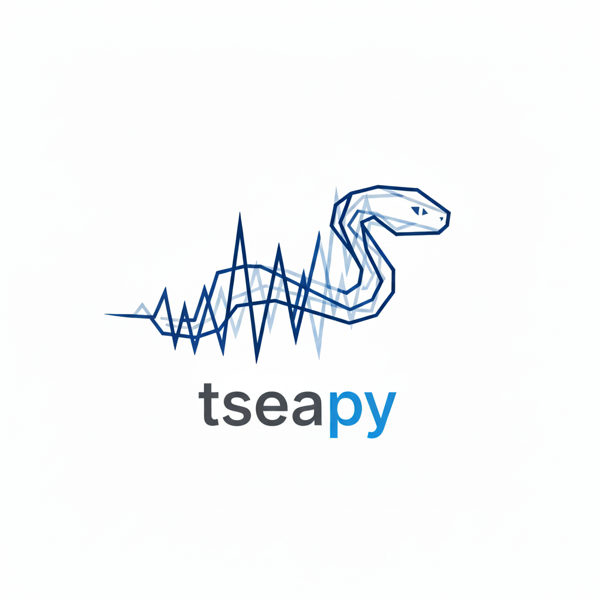
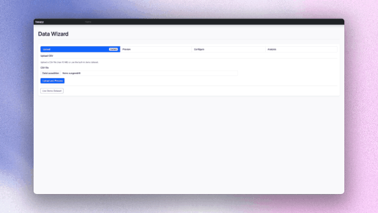

# tseapy

<p align="center">
  <a href="https://github.com/mrkshdt/tseapy/actions/workflows/ci.yml"></a>
  <a href="https://github.com/mrkshdt/tseapy/actions/workflows/publish-testpypi.yml"></a>
  <a href="https://github.com/mrkshdt/tseapy/actions/workflows/publish-pypi.yml"></a>
  <a href="https://pypi.org/project/tseapy/"></a>
  <a href="https://pypi.org/project/tseapy/"></a>
  <a href="https://pypi.org/project/tseapy/"></a>
</p>

<p align="center">
  
</p>

`tseapy` is an open-source web app for interactive time-series analysis.
You can upload CSV data and run built-in algorithms for:
- change detection
- pattern recognition
- motif detection
- smoothing
- forecasting
- decomposition
- frequency analysis

<p align="center">
  
</p>

## Install From PyPI

Prerequisites:
- Python 3.10+
- pip

```bash
python3 -m venv /tmp/tseapy-run
source /tmp/tseapy-run/bin/activate
python -m pip install -U pip
python -m pip install tseapy
tseapy --host 127.0.0.1 --port 5000 --no-debug
```

Open [http://127.0.0.1:5000](http://127.0.0.1:5000).

## Install From Source

```bash
git clone https://github.com/mrkshdt/tseapy.git
cd tseapy
make install
make run
```

No `make`:

```bash
python3 -m venv .venv
source .venv/bin/activate
python -m pip install -U pip setuptools wheel
python -m pip install .
tseapy --host 127.0.0.1 --port 5000 --no-debug
```

Editable mode (developer workflow):

```bash
make install-editable
```

## Common Commands

```bash
make test
make build
make wheel-smoke
make wheel-smoke-offline
```

## Docker

```bash
docker build -t tseapy:local .
docker run --rm -p 5000:5000 -e TSEAPY_SECRET_KEY=dev-secret tseapy:local
```

With compose:

```bash
docker compose up --build
```

Health check:

```bash
curl http://127.0.0.1:5000/healthz
```

## Runtime Configuration

Environment variables:
- `TSEAPY_HOST` (default `127.0.0.1`)
- `TSEAPY_PORT` (default `5000`)
- `TSEAPY_DEBUG` (`0` or `1`)
- `TSEAPY_SECRET_KEY` (recommended in shared environments)
- `TSEAPY_MAX_UPLOAD_MB` (default `10`)
- `TSEAPY_CACHE_TYPE` (default `SimpleCache`)
- `TSEAPY_CACHE_DEFAULT_TIMEOUT` (default `3600`)

## Production Serving

WSGI entrypoint:

```bash
gunicorn wsgi:app
```

## Documentation

- `CONTRIBUTING.md`: development workflow and contribution standards
- `RELEASE.md`: release runbook and trusted-publishing configuration
- `TROUBLESHOOTING.md`: setup and publish failure fixes
- `VERSIONING.md`: version bump policy
- `CHANGELOG.md`: release notes history
